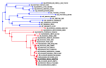
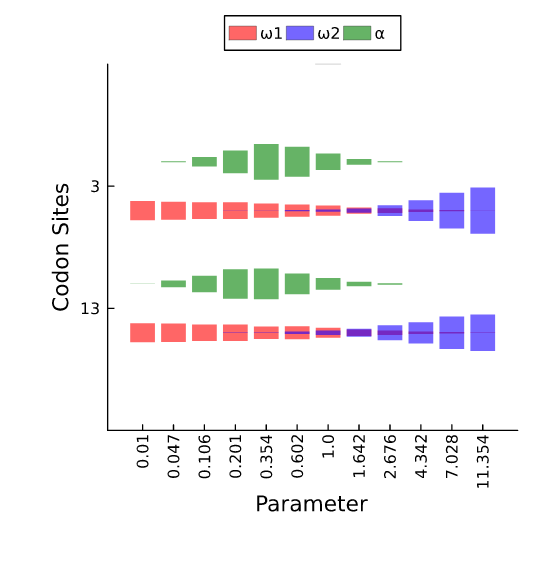

# difFUBAR
An interface to [difFUBAR (awaiting the correct link)](https://academic.oup.com/mbe/article/30/5/1196/998247)
## Example
Reads codon sequences from [this FASTA file](https://raw.githubusercontent.com/MurrellGroup/CodonMolecularEvolution.jl/main/test/data/Ace2_no_background/Ace2_tiny_test.fasta), and a tagged phylogeny from [this NEXUS tree file](https://raw.githubusercontent.com/MurrellGroup/CodonMolecularEvolution.jl/main/test/data/Ace2_no_background/Ace2_no_background.nex).
```julia
using MolecularEvolution, FASTX, CodonMolecularEvolution
analysis_name = "output/Ace2"
seqnames,seqs = read_fasta("data/Ace2_tiny_test.fasta");
treestring, tags, tag_colors = import_colored_figtree_nexus_as_tagged_tree("data/Ace2_no_background.nex")
df,results = difFUBAR(seqnames, seqs, treestring, tags, analysis_name);
```
```
Step 1: Initialization. If exports = true, tree showing the assignment of branches to groups/colors will be exported to: output/Ace2_tagged_input_tree.svg.
Step 2: Optimizing global codon model parameters.
0.0% 29.0% 58.0% 87.0% 
Step 4: Running Gibbs sampler to infer site categories.
Step 5: Tabulating and plotting. Detected sites:
Site 3 - P(ω1 > ω2):0.0075; P(ω2 > ω1):0.9805; P(ω1 > 1):0.1205; P(ω2 > 1):0.9675
Site 13 - P(ω1 > ω2):0.0175; P(ω2 > ω1):0.9605; P(ω1 > 1):0.13; P(ω2 > 1):0.9305

If exports = true, writing results for all sites to CSV: output/Ace2_posteriors.csv
Plotting alpha and omega distributions. If exports = true, saved as output/Ace2_violin_*.pdf
```
*Here's a selection of the output files:*

output/Ace2\_tagged\_input\_tree.svg


!!! note
    difFUBAR allows for an optional, untagged, background branch set.

output/Ace2\_site\_omega\_means.pdf


output/Ace2\_violin\_all\_params.pdf



!!! note
    The output has a stochastic element to it due to the MCMC.

## Interface
```@docs
difFUBAR
```

### For a simple and often optimal configuration
- Launch Julia in the following manner: `julia -t auto`
- Keep the default values of the kwargs `version` and `t`
This lets Julia decide the amount of Julia threads and lets CodonMolecularEvolution.jl decide the [difFUBARGrid](@ref) subtype to dispatch on and the degree of parallelization.

### difFUBARGrid
**Subtypes** that decide which method to use for the grid likelihood computations.
```@docs
difFUBARBaseline
difFUBARParallel
difFUBARTreesurgery
difFUBARTreesurgeryAndParallel
```