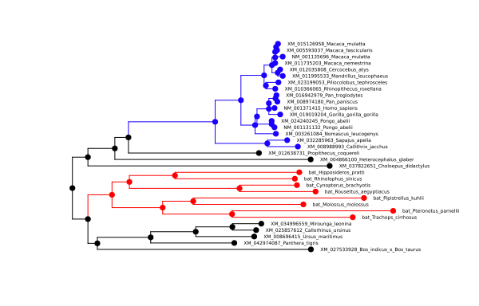

# difFUBAR
An interface to [difFUBAR (awaiting the correct link)](https://academic.oup.com/mbe/article/30/5/1196/998247)
## Example
Reads codon sequences from [this FASTA file](https://raw.githubusercontent.com/MurrellGroup/CodonMolecularEvolution.jl/main/test/data/Ace2_tiny/Ace2_tiny_tagged.fasta), and a tagged phylogeny from [this NEXUS tree file](https://raw.githubusercontent.com/MurrellGroup/CodonMolecularEvolution.jl/main/test/data/Ace2_tiny/Ace2_tiny_tagged.nex).
```julia
using MolecularEvolution, FASTX, CodonMolecularEvolution
#Trigger PlotsExt
using Plots, Phylo
analysis_name = "output/Ace2"
seqnames,seqs = read_fasta("Ace2_tiny_tagged.fasta");
treestring, tags, tag_colors = import_colored_figtree_nexus_as_tagged_tree("Ace2_tiny_tagged.nex")
df,results = difFUBAR(seqnames, seqs, treestring, tags, analysis_name);
```
```
Step 1: Initialization. If exports = true, tree showing the assignment of branches to groups/colors will be exported to: output/Ace2_tiny_tagged_input_tree.svg.
Step 2: Optimizing global codon model parameters.
Optimized single α,β LL=-17461.802926840995 with α=1.6881756897953715 and β=0.8305228439241399.
Step 3: Calculating grid of 12096-by-808 conditional likelihood values (the slowest step). Currently on:
0.0% 4.0% 8.0% 12.0% 17.0% 21.0% 25.0% 29.0% 33.0% 37.0% 41.0% 45.0% 50.0% 54.0% 58.0% 62.0% 66.0% 70.0% 74.0% 79.0% 83.0% 87.0% 91.0% 95.0% 99.0% 
Step 4: Running Gibbs sampler to infer site categories.
Step 5: Tabulating and plotting. Detected sites:
Site 3 - P(ω1 > ω2):0.0185; P(ω2 > ω1):0.9655; P(ω1 > 1):0.1285; P(ω2 > 1):0.941
Site 26 - P(ω1 > ω2):0.9765; P(ω2 > ω1):0.007; P(ω1 > 1):0.9395; P(ω2 > 1):0.1205
Site 29 - P(ω1 > ω2):0.9865; P(ω2 > ω1):0.003; P(ω1 > 1):0.9985; P(ω2 > 1):0.1785
Site 36 - P(ω1 > ω2):0.9965; P(ω2 > ω1):0.0005; P(ω1 > 1):0.951; P(ω2 > 1):0.027
Site 68 - P(ω1 > ω2):0.9665; P(ω2 > ω1):0.0145; P(ω1 > 1):0.568; P(ω2 > 1):0.0255
Site 69 - P(ω1 > ω2):0.2265; P(ω2 > ω1):0.4945; P(ω1 > 1):0.971; P(ω2 > 1):0.977
Site 75 - P(ω1 > ω2):0.0105; P(ω2 > ω1):0.9735; P(ω1 > 1):0.088; P(ω2 > 1):0.915
Site 89 - P(ω1 > ω2):0.946; P(ω2 > ω1):0.0195; P(ω1 > 1):0.978; P(ω2 > 1):0.227
Site 93 - P(ω1 > ω2):0.977; P(ω2 > ω1):0.0065; P(ω1 > 1):0.9405; P(ω2 > 1):0.0635
Site 94 - P(ω1 > ω2):0.9825; P(ω2 > ω1):0.0035; P(ω1 > 1):0.975; P(ω2 > 1):0.1525
Site 101 - P(ω1 > ω2):0.951; P(ω2 > ω1):0.0175; P(ω1 > 1):0.8605; P(ω2 > 1):0.113
Site 214 - P(ω1 > ω2):0.925; P(ω2 > ω1):0.0175; P(ω1 > 1):0.9975; P(ω2 > 1):0.422
Site 215 - P(ω1 > ω2):0.968; P(ω2 > ω1):0.0095; P(ω1 > 1):0.9025; P(ω2 > 1):0.0915
Site 218 - P(ω1 > ω2):0.98; P(ω2 > ω1):0.0045; P(ω1 > 1):0.969; P(ω2 > 1):0.0925
Site 220 - P(ω1 > ω2):0.003; P(ω2 > ω1):0.9835; P(ω1 > 1):0.2815; P(ω2 > 1):0.986
Site 251 - P(ω1 > ω2):0.0125; P(ω2 > ω1):0.967; P(ω1 > 1):0.0635; P(ω2 > 1):0.7555
Site 282 - P(ω1 > ω2):0.974; P(ω2 > ω1):0.009; P(ω1 > 1):0.9265; P(ω2 > 1):0.099
Site 288 - P(ω1 > ω2):0.93; P(ω2 > ω1):0.0265; P(ω1 > 1):0.957; P(ω2 > 1):0.181
Site 361 - P(ω1 > ω2):0.012; P(ω2 > ω1):0.959; P(ω1 > 1):0.528; P(ω2 > 1):0.988
Site 366 - P(ω1 > ω2):0.0135; P(ω2 > ω1):0.972; P(ω1 > 1):0.0945; P(ω2 > 1):0.8965
Site 389 - P(ω1 > ω2):0.9815; P(ω2 > ω1):0.006; P(ω1 > 1):0.9615; P(ω2 > 1):0.0645
Site 422 - P(ω1 > ω2):0.9675; P(ω2 > ω1):0.0095; P(ω1 > 1):0.9185; P(ω2 > 1):0.084
Site 431 - P(ω1 > ω2):0.988; P(ω2 > ω1):0.0025; P(ω1 > 1):0.994; P(ω2 > 1):0.123
Site 533 - P(ω1 > ω2):0.9535; P(ω2 > ω1):0.021; P(ω1 > 1):0.9235; P(ω2 > 1):0.162
Site 557 - P(ω1 > ω2):0.8025; P(ω2 > ω1):0.0685; P(ω1 > 1):0.974; P(ω2 > 1):0.64
Site 570 - P(ω1 > ω2):0.9805; P(ω2 > ω1):0.0035; P(ω1 > 1):0.97; P(ω2 > 1):0.104
Site 574 - P(ω1 > ω2):0.9805; P(ω2 > ω1):0.0065; P(ω1 > 1):0.9515; P(ω2 > 1):0.0995
Site 580 - P(ω1 > ω2):0.9655; P(ω2 > ω1):0.009; P(ω1 > 1):0.624; P(ω2 > 1):0.04
Site 609 - P(ω1 > ω2):0.9705; P(ω2 > ω1):0.0095; P(ω1 > 1):0.9605; P(ω2 > 1):0.133
Site 661 - P(ω1 > ω2):0.6195; P(ω2 > ω1):0.161; P(ω1 > 1):0.99; P(ω2 > 1):0.9445
Site 697 - P(ω1 > ω2):0.9515; P(ω2 > ω1):0.02; P(ω1 > 1):0.9665; P(ω2 > 1):0.166
Site 709 - P(ω1 > ω2):0.0035; P(ω2 > ω1):0.986; P(ω1 > 1):0.1365; P(ω2 > 1):0.8755
Site 776 - P(ω1 > ω2):0.0105; P(ω2 > ω1):0.965; P(ω1 > 1):0.1385; P(ω2 > 1):0.915
Site 787 - P(ω1 > ω2):0.02; P(ω2 > ω1):0.942; P(ω1 > 1):0.4145; P(ω2 > 1):0.9505
Site 791 - P(ω1 > ω2):0.0115; P(ω2 > ω1):0.9645; P(ω1 > 1):0.1155; P(ω2 > 1):0.908

If exports = true, writing results for all sites to CSV: output/Ace2_tiny_posteriors.csv
Plotting alpha and omega distributions. If exports = true, saved as output/Ace2_tiny_violin_*.pdf
```
*Here's a selection of the output files:*

output/Ace2\_tiny\_tagged\_input\_tree.svg


!!! note
    difFUBAR allows for an optional, untagged, background branch set.

output/Ace2\_tiny\_site\_omega\_means.pdf


output/Ace2\_tiny\_violin\_all\_params.pdf


!!! note
    The output has a stochastic element to it due to the MCMC.

## Interface
```@docs
difFUBAR
```

### For a simple and often optimal configuration
- Launch Julia in the following manner: `julia -t auto`
- Keep the default values of the kwargs `version` and `t`
This lets Julia decide the amount of Julia threads and lets CodonMolecularEvolution.jl decide the [difFUBARGrid](@ref) subtype to dispatch on and the degree of parallelization.

### difFUBARGrid
**Subtypes** that decide which method to use for the grid likelihood computations.
```@docs
difFUBARBaseline
difFUBARParallel
difFUBARTreesurgery
difFUBARTreesurgeryAndParallel
```