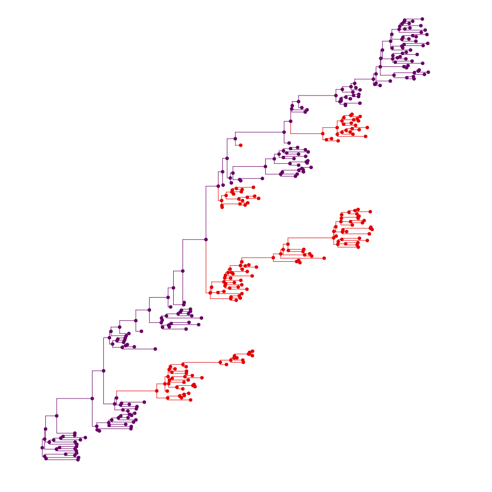
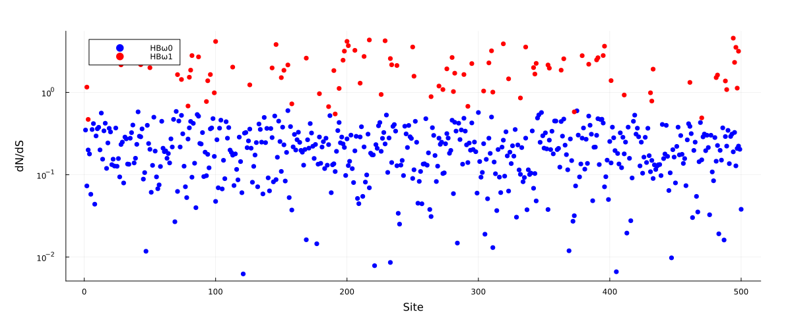

# Simulating with time-varying fitness

Uses [this tree](simtree_tagged.svg) as input.

```julia
#Read in a tree where the Newick string has tags (eg. "{G1}" or "{G2}") on branches.
#Can be tagged with: https://murrellgroup.github.io/WebWidgets/phylotagger.html
ts, tags = import_labeled_phylotree_newick("simtree_tagged.tre")
tree = gettreefromnewick(ts, FelNode)

#First viz at the tree with tags
for (i,n) in enumerate(getnodelist(tree))
    (length(n.children) > 0) && (n.name = "N$(i)_"*n.name) #Make internal node names unique (only needed for plotting)
    n.node_data = Dict("g" => (occursin(tags[2], n.name) ? 1.0 : 0.0))
end
pl = plot(get_phylo_tree(tree), showtips = false, marker_z = "g", line_z = "g", markerstrokewidth = 0, colorbar = false, linecolor = :darkrainbow, markercolor = :darkrainbow)
savefig("tagged_simtree_phylo.svg")
```



```julia
#500 codon sites in total, where 100 will undergo a fitness shift:
S, nsel = 500, 100
selsites = sort(sample(1:S, nsel, replace = false))
nucm = CodonMolecularEvolution.demo_nucmat #Using a nuc matrix derived from a flu dataset

#Compute std dev of fitnesses for the target peak dN/dS, aiming for a mean dN/dS of 2.0 at the fitness shift boundary:
σ = maxdNdS2std(2.0)
m0fs = randn(20,S) .* σ
m1fs = copy(m0fs)
m1fs[:,selsites] .= randn(20,nsel) .* σ

#Plot analytical expectations for background dN/dS, and for peak dN/dS at the host change boundary.
scatter([HBdNdS(m0fs[:,i], nucm = nucm) for i in 1:S], size = (1200,500), yscale = :log10, label = "HBω0", msw = 0, color = "blue", xlabel = "Site", ylabel = "dN/dS", margins = 1Plots.cm)
scatter!(selsites, [HBdNdS(m0fs[:,i], m1fs[:,i], nucm = nucm) for i in selsites], size = (1200,500), label = "HBω1", msw = 0, color = "red")
savefig("dnds_plot.svg")
```



```julia
#Specify two models, m1 and m2, sharing alpha but with different fitnesses for the `selsites` sites:
using Distributions

alphas = rand(Gamma(10,0.1), S)
m1 = ShiftingHBSimModel(S, alphas, [PiecewiseOUModel(m0fs[:,i]) for i in 1:S], nucm)
m2 = ShiftingHBSimModel(S, alphas, [PiecewiseOUModel(m1fs[:,i]) for i in 1:S], nucm)

#Use model m1 when "{G1}" occurs in the sequence name. Models are in [] because we have an array of models per partition, when passing a function:
mfunc(n) = occursin("{G2}", n.name) ? [m2] : [m1]

#The process should be at equilibrium for whatever the root model is, and this will use the root model:
internal_message_init!(tree, ShiftingHBSimPartition(m1))

#Simeulate under this process:
sample_down!(tree, mfunc)

#Write sequences to a .fasta file:
write_fasta("simu_seqs.fasta", leaf_samples(tree), seq_names = leaf_names(tree))
```
